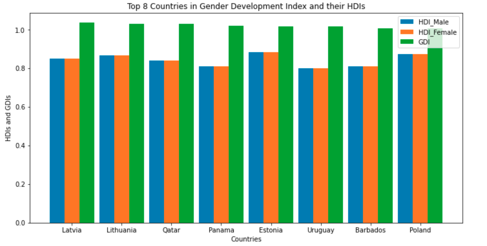
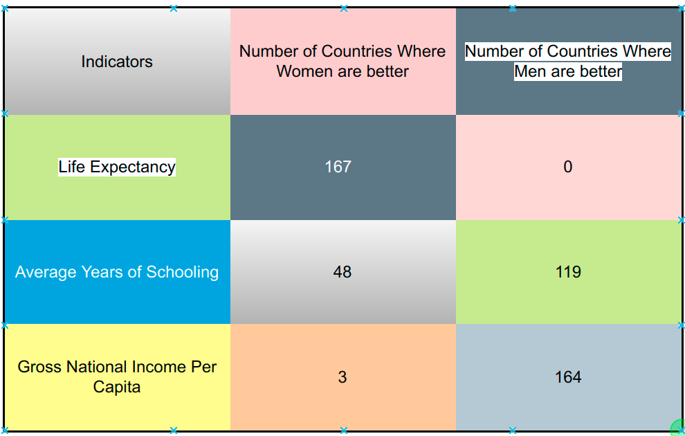
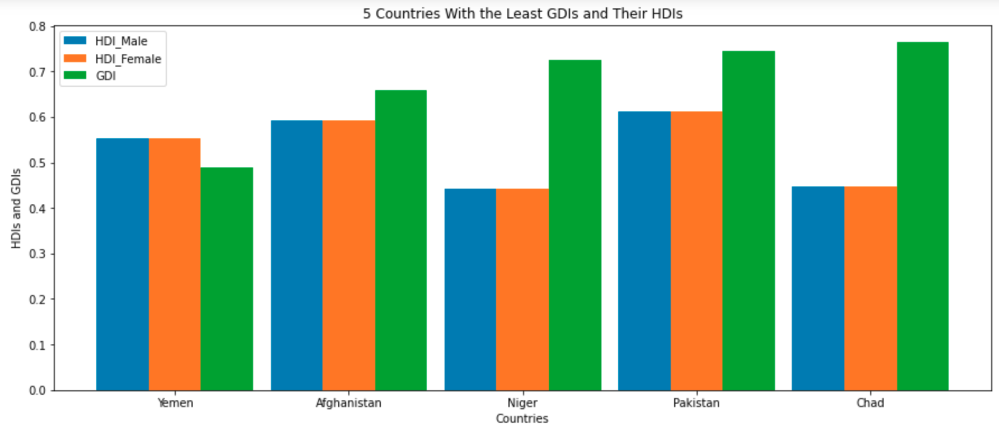
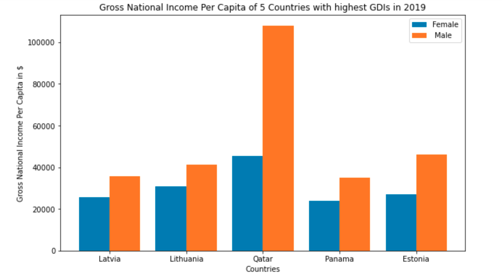
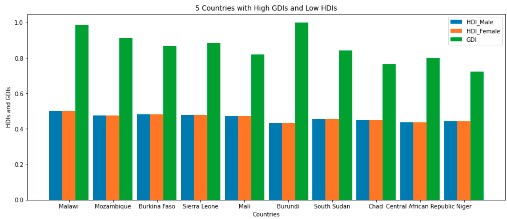

# Problem Statement
The quest for gender parity has continued to grow over the years. Gender Development Index (GDI) is one of those parameters of assessing gender equality.  GDI on the one hand is a measure of the gender gaps within key development indices. The key index of comparison is known as Human Development Index (HDI). [United Nations Development Programme (UNDP)](https://hdr.undp.org/en/content/gender-development-index-gdi?utm_source=EN&utm_medium=GSR&utm_content=US_UNDP_PaidSearch_Brand_English&utm_campaign=CENTRAL&c_src=CENTRAL&c_src2=GSR&gclid=Cj0KCQjw-JyUBhCuARIsANUqQ_KWhmZEJ4ewUgU07Ozo0CM8BEUp5cbuZEEUFzv6m1ftWN_3XceTNFgaAju6EALw_wcB) on the other hand defines GDI as the ratio of female HDI to the male HDI derived from three critical areas of human development, namely: **health, knowlegde and standard of living**. Health is measured by the life expectancies, knowledge by expected and average years of schooling and standard of living by gross national income (GNI) per capita.  One may wonder if GDI of 1 is synonymous to gender equality.  UNDP defined index for measuring gender inequality is known as gender inequality index (GII). GII is based on three key dimension of **health, empowerment and labour market**. These dimension indices and key indicators of GII are shown below:

1. **reproductive health**:
    * maternal mortality ratio 
    *  adolescent birth rate
2. **empowerment**:
    *  female and male population with at least secondary education:
    * female and male shares of parliamentary seats 
3. **labour market**: 
    * female and male labour force participation rate . 
Most countries of the world have laws and policies aimed at bridging the gaps in GII and GDIs.

What are the top Countries in terms of GDIs in 2019? Which of the HDI Indicators lead to highest GDI gaps? When it comes to GDIs, which countries are worst? What does GDI of 1 mean? The answers to these questions and more are what this piece aims to address with 2019 data from UNDP.


## Data Understanding

The data used for the analysis in this piece of work comes from [kaggle](https://www.kaggle.com/code/ayushv322/gender-development-index-pre-processing-and-eda) and was based on 2019 data from UNDP. The original dataset has a total of **190** rows and 14 features including: 

1. HDI Rank - Human Development Index Rank
2. Country - 
3. GDI_Value -Country's GDI
4. GDI_Group - The Groups of GDI
5. HDI_Female - 
6. HDI_Male
7. Lif_Expec_Female - Life Expectancy of Females
8. Lif_Excep_Male   - Life Expectancy of Males
9. Excep_Yrs_Schooling_Female - Expected years of schooling 
10. Excep_Yrs_Schooling_Male - Expected years of schooling 
11. Mean_Yrs_Schooling_Female - Mean years of schooling 
12. Mean_Yrs_Schooling_Male -  Mean years of schooling 
13. GNI_PC_Female  - Gross National Income Female
14. GNI_PC_Male    - Gross National Income Male


## Data Preparation

 The following 22 countries and their data are excluded in the analysis as a result of having no GDI values for the year under review: **Liechtenstein, Andorra, Palau, Bahamas, Seychelles, Grenada, Saint Kitts and Nevis, Antigua and Barbuda, Fiji, Dominica, Samoa, Turkmenistan, Marshall Islands, Kiribati, Micronesia (Federated States of), Vanuatu, Equatorial Guinea, Solomon Islands, Papua New Guinea, Djibouti, Guinea-Bissau and Eritrea.**

 Again, the first row of the dataset contained only the a constant value of 2019 which was the year the dataset was collected and includes two missing values. Hence,this row was dropped. This reduced the number of rows of data or countries whose GDIs and other paramaters to 167.

 The numerical features present in the dataset were all of string type. Cleaning led to their conversions to float data type. The GNI_PC columns contains ```commas``` and as such were removed so as to work to them as numerical values they are.


### Evaluation and Analyses

* What are the top Countries in terms of GDIs in 2019?

There are specifically 21 countries whose GDIs were 1 or more in 2019. They are Latvia, Lithuania, Qatar, Mongolia, Panama, Estonia, Uruguay, Lesotho, Moldova (Republic of), Nicaragua, Venezuela (Bolivarian Republic of), Thailand, Barbados, Belarus, Philippines, Russian Federation, Poland, Namibia, Trinidad and Tobago, Slovenia and Ukraine. The diagram below depicts the top 8 countries in terms of GDIs and their corresponding HDIs.




* Which of the HDI Indicators lead to highest GDI gaps? 

The Gross National Income per Capita (GNI_PC) is the major cause of disparity in GDIs against females. Findings from the data indicates that GNI_PC favours males as 164  out of the 167 countries have GNI_PC of males higher than those of their female counterparts. On the other hand, women are 100 percent better than men in terms of life expectancies as the life expectancies of females in 167 out of the 167 countries of interest are higher than those of men. On the education dimension, 48 out of the 167 countries have average number of years of schooling of females more than those of males. These indicators are shown in the table below.




* 5 Countries with Worst GDIs?
There are many countries with terrible GDIs, prominent among them are: Yemen, Afghanistan, Niger, Pakistan and Chad.
There pictorial representations are depicted in the chart below. 


#####  Does Gender Development Index (GDI) of **one** mean Gender Equality? 
The answer is no. A GDI of **one or more** simply connotes that women experience equal or better human developments in most of the HDI indicators of life expectancy, average years of schooling and GNI per capita. However, the analysis of the 2019 data from UNDP shows clearly that among countries with high GDIs  only three countries, namely: Timor-Leste, Zambia and Burundi have female GNIs per capita higher than  those of males. However, these are not part of the top countries with GDIs equal to or more than one. The diagram below shows the GNI per capita of the top 5 countries in GDIs. And the table thereafter provides a comprehensive table detailing all the key indicators necessary for HDI as well as parts of the GII.




**Are all countries with high GDI values have high HDIs?**

Not all the countries with high GDI values have high HDI values. There are  10 countries with GDI values more than 0.7 whose HDI values are less than 0.5. The countries are: Malawi, Mozambique, Burkina Faso, Sierra Leone, Mali, Burundi, South Sudan, Chad and Central African Republic. These are all incidentally African countries. The implication is that these countries are doing well with respect to GDIs but have serious human developmental issues. 5 of them shown in the diagram below. 




## Conclusion

In conclusion, GDI is an important factor to consider when discussing gender parity issues. However, it is not sufficient criterion to determine gender parity as gender equality takes into account the reproductive health of females . Empowerment and labour market share reasonable similarity with GNI per capita which is a key indicator of GDI. In order to close the gaps in GDI, ways of enhancing the GNI per capita of females are to be aggressively pursued and effected.
  